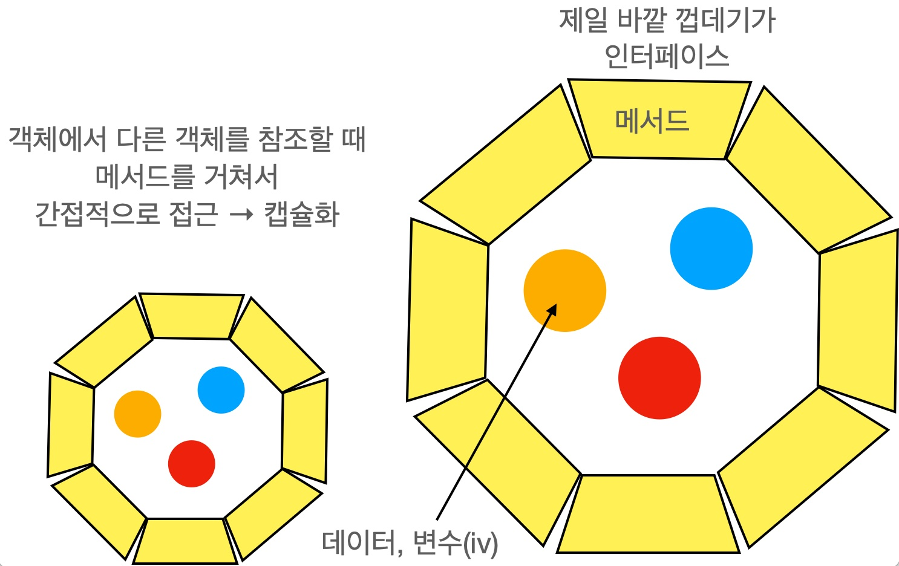

# 객체 지향 part2
## 1. 상속(inheritance)
### 상속의 정의(class 자손클래스 extends 조상클래스)
- 기존의 클래스를 재사용하여 새로운 클래스를 작성하는 것. 
- 두 클래스를 조상과 자손으로 관계를 맺어주는 것. 
- 자손은 조상의 모든 멤버를 상속받는다.(생성자, 초기화블럭 제외)
- 자손의 멤버개수는 조상보다 항상 많거나 같다.

### 포함관계
한 클래스의 멤버변수로 다른 클래스 타입의 참조변수를 선언하는 것을 뜻한다. </br>
하나의 거대한 클래스를 작성하는 것보다 작은 단위의 클래스를 먼저 만들고, 이들을 조합해서 하나의 커다란 클래스로 만든다. 

### 클래스간의 관계 결정하기
- 상속관계: ~은 ~이다.(~ is a ~)
- 포함관계: ~은 ~을 가지고 있다.(~ has a ~)</br>
상속은 꼭 필요할 때만, 잘 모르면 포함관계

### 단일  상속(single inheritance)
- Java는 단일상속만을 허용한다.(C++는 다중상속 허용)
- 비중이 높은 클래스 하나만 상속관계로, 나머지는 포함관계.
 
### Object 클래스
- 모든 클래스의 최상위에 있는 조상 클래스이다. 
- 다른 클래스로부터 상속 받지 않는 모든 클래스들은 자동적으로 Object클래스로부터 상속받게 한다. 
- 모든 클래스는 Object클래스에 정의된 11개의 메서드를 상속받는다.

## 2. 오버라이딩(overriding)
### 오버라이딩이란?
조상 클래스로부터 상속받은 메서드의 내용만을 상속받는 클래스에 맞게 변경하는 것.

### 오버라이딩의 조건(⭑규칙⭑)
1. 선언부가 조상 클래스의 매서드와 일치해야 한다.(이름, 매개변수, 반환타입)
2. 접근 제어자를 조상 클래스의 메서드보다 좁은 범위로 변경할 수 없다. 
3. 조상 클래스의 메서드보다 많은 예외를 선언할 수 없다. 

### 오버로딩 vs. 오버라이딩
- 오버로딩: 기존에 없는 새로운 메서드를 정의하는 것(new)
- 오버라이딩: 상속받은 메서드의 내용을 변경하는 것(change, modify)

### super ≒ this
- 자손클래스에서 조상클래스로부터 상속받은 멤버를 참조하는데 사용되는 참조변수. 조상의 멤버와 자신의 멤버를 구별하는 데 사용.
- 인스턴스 메서드 내에서만 사용가능 → static 메서드 사용 불가

### super() - 조상 클래스의 생성자
- 조상 클래스의 생성자를 호출하는데 사용된다.(생성자와 초기화블럭은 상속되지 않는다.)
- 조상의 멤버는 조상의 생성자를 호출해서 초기화. 자손의 생성자는 자신이 선언한 변수만 초기화 할 수 있다.
- 모든 클래스의 생성자 첫 줄에는 생성자 this() 또는 super()를 호출해야 한다. 그렇지 않으면 컴파일러가 자동적으로 super();를 생성자의 첫 줄에 삽입한다. 
- 자손 클래스의 멤버가 조상 클래스의 멤버를 사용할 수도 있으므로 조상의 멤버들이 먼저 초기화되어 있어야 하기 때문이다.

## 3. package와 import
#### 패키지(package)
- 패키지란 클래스의 묶음이다. 
- 클래스의 실제 이름은 패키지명이 포함.(java.lang.String)

### 패키지의 선언
```java
package 패키지명;
```
모든 클래스는 하나의 패키지에 속하며 패키지가 선언되지 않은 클래스는 자동으로 이름없는(default) 패키지에 속한다.

### 클래스패스(classpath) 설정
- 클래스 파일(*.class)의 위치를 알려주는 경로(path). 
- 환경변수(classpath)로 관리하며, 경로간의 구분자는 ';'를 사용한다.
- 환경변수(classpath)에 패키지의 루트를 등록해줘야 한다.

### import 문
- import문으로 사용하고자 하는 클래스의 패키지를 미리 명시하면 클래스를 사용할 때 패키지명은 생략할 수 있다.
- 단축키 'ctrl+shift+o'를 누르면` 자동으로 import문을 추가

### import문의 선언
일반적인 소스파일(*.java)의 구성은 다음의 순서로 되어 있다.
```java
package문
import문: import 패키지명.클래스명; 또는 패키지.*;
클래스 선언
```

### static import문
static import문을 사용하면 static멤버를 호출할 때 클래스 이름을 생략할 수 있다.
```java
import static java.lang.System.out;
import static java.lang.Math.*;

out.println(random()); // System.out.println(Math.random());
```

## 4. 제어자(modifier)
### 제어자란?
클래스, 변수, 메서드의 선언부에 사용되어 부가적인 의미 부여(형용사)
- 접근 제어자: public, protected, default, private(제일 왼쪽)
- 그 외: static, final, abstract, naive … </br>

하나의 대상에 대해서 여러 제어자를 사용하는 것이 가능하지만, 접근 제어자는 하나만 선택해서 사용할 수 있다.

### static
- static은 ‘클래스의' 또는 ‘공통적인’의 의미를 가지고 있다.
- static이 사용될 수 있는 곳 - 멤버변수, 메서드, 초기화 블럭
- static메서드 내에서 인스턴스 멤버들을 직접 사용할 수 없다.

### final
- ‘마지막의’ 또는 ‘변경될 수 없는’의 의미, 모든 대상에 사용 가능
- final 사용될 수 있는 곳: 클래스, 멤버변수, 메서드, 지역변수
  - 클래스: 변경될 수 없는 클래스, 조상이 될 수 없는 클래스, String, Math
  - 메서드: 오버라이딩 할 수 없는 메서드
  - 변수(멤버 변수, 지역변수): 값을 변경할 수 없는 상수(항상 static final 아님)

### abstract
- abstract는 ‘추상의’, ‘미완성’의 의미를 가지고 있다.
- abstract가 사용될 수 있는 곳 - 클래스, 메서드
  - 클래스: 클래스 안에 추상 메서드가 선언되어 있음.
  - 메서드: 선언부만 작성하고, 구현부는 작성하지 않음.
- abstract클래스는 객체를 생성할 수 없고, 추상메서드를 갖고 있으니 상속받아서 완성해줘야 한다.

### 접근 제어자(access modifier)
- 사용될 수 있는 곳: 클래스, 멤버변수, 메서드, 생성자

|제어자| 같은 클래스 |같은 패키지|자손 클래스|전체|
|---|-------|---|---|---|
|public| O     |O|O|O|
|protected|O|O|O|
|(default)|O|O|
|private|O|

public > protected > (default) > private

### 접근 제어자를 이용한 캡슐화를 하는 이유
- 외부로부터 데이터를 보호하기 위해
- 외부에는 불필요한, 내부적으로만 사용되는 부분을 감추기 위해

### 생성자의 접근 제어자(싱글톤 패턴)
생성자에 접근 제어자를 사용함으로써 인스턴스의 생성을 제한할 수 있다.</br>
객체가 1개만 존재해야 하는 경우: 데이터를 보호하기 위해 한 곳에서 관리할 때

### 제어자(modifier)의 조합
1. 메서드에 static과 abstract를 함께 사용할 수 없다. 
2. 클래스에 abstract와 final을 동시에 사용할 수 없다. 
3. abstract메서드의 접근 제어자가 private일 수 없다. 
4. 메서드에 private과 final을 같이 사용할 필요는 없다.

### Math클래스가 인스턴스를 생성할 필요가 없는 이유는?
Math클래스는 몇 개의 상수와 static메서드만으로 구성되어 있기 때문에 객체를 생성할 필요가 없다.

## 5. 다형성(polymorphism)
### 다형성이란?
- 조상타입의 참조변수로 자손타입의 객체를 다루는 것
- 참조변수가 사용할 수 있는 멤버의 개수는 인스턴스의 멤버 개수보다 같거나 적어야 한다.
- 조상타입의 참조변수로 자손타입의 인스턴스를 참조할 수 있지만, 반대로 자손타입의 참조변수로 조상타입의 인스턴스를 참조할 수는 없다. 

### 참조변수의 형변환
상속관계에 있는 클래스 사이에서만 형변환 가능.(상속관계는 무조건 가능)
- 자손타입 → 조상타입(Up-casting): 형변환 생략 가능 
- 자손타입 ← 조상타입(Down-casting): 형변환 생략 불가

### 참조변수의 형변환은 왜 하나?
참조변수의 타입을 변경하면서 사용할 수 있는 멤버의 개수를 조절하기 위해서

### instanceof 연산자
- 참조변수의 형변환 가능여부 확인에 사용. 
- 형변환 전에 반드시 instanceof로 확인해야 함.
- 주로 조건문에 사용 if(참조변수 instanceof 타입(클래스명))

### 참조변수와 인스턴스의 연결
- 멤버변수가 조상 클래스와 자손 클래스에 중복으로 정의된 경우, 참조변수의 타입에 따라 연결되는 멤버변수가 달라진다. 즉, 조상 타입의 참조변수를 사용했을 때는 조상 클래스에 선언된 멤버변수가 사용되고, 자손 타입의 참조변수를 사용했을 때는 자손 클래스에 선언된 멤버변수가 사용된다.
- 그러나 메서드가 중복정의된 경우, 참조변수의 타입에 관계 없이 항상 실제 인스턴스의 타입에 정의된 메서드가 호출된다. 

### 매개변수의 다형성
참조형 매개변수는 메서드 호출시, 자신과 같은 타입 또는 자손타입의 인스턴스를 넘겨줄 수 있다.

### 다형성의 장점
1. 다형적 매개변수(조상타입의 참조변수로 자손타입의 객체를 다루는 것)
2. 하나의 배열에 여러 종류 객체 저장(다루기)

### 여러 종류의 객체를 배열로 다루기
- 조상타입의 참조변수 배열을 사용하면, 조상타입의 배열에 자손들의 객체를 담을 수 있다. 
- 또는 묶어서 다루고 싶은 객체들의 상속관계를 따져서 가장 가까운 공통조상 클래스 타입의 참조변수 배열을 생성해서 객체들을 저장하면 된다

## 6. 추상클래스(abstract class)
### 추상클래스란?
- 추상 메서드를 포함하고 있는 클래스.
- 추상클래스로 인스턴스를 생성할 수 없다. 추상클래스는 상속을 통해서 자손클래스에 의해서만 완성될 수 있다.

### 추상화
클래스간의 공통점을 찾아내서 공통의 조상을 만드는 작업 
덜 구체적: 변경에 용이


### 추상메서드(abstract method) 
- 선언부만 있고 구현부(몸통)가 없는 메서드
- 조상으로부터 상속받은 추상메서드 중 하나라도 구현하지 않는다면, 자손클래스 역시 추상클래스로 지정해 주어야 한다. 
```java
abstract 리턴타입 메서드이름();
```

### 메서드를 미완성으로 남겨 놓는 이유는?
공통적으로 꼭 필요하지만, 메서드 내용이 상속받는 클래스에 따라 다르게 구현될 것으로 예상되는 경우(몸통이 자손마다 다른 경우).

### 추상클래스의 작성
- 여러 클래스에 공통적으로 사용될 수 있는 추상클래스를 작성하거나 기존클래스의 공통 부분을 뽑아서 추상클래스를 만든다. 
- 자손클래스에서 추상메서드 반드시 구현하도록 강요하기 위해 추상메서드 선언 

### 추상메서드의 구현을 강제한다는 것의 의미는?
추상메서드로 정의되어 있지 않고 빈 구현부만 가지도록 정의되어 있다면, 상속받는 자손 클래스에서는 이 메서드들이 온전히 구현된 것으로 인식하고 오버라이딩을 통해 자신의 클래스에 맞도록 구현하지 않을 수도 있기 때문이다.

## 7. 인터페이스(interface)
### 인터페이스란?
추상메서드의 집합, 접근제어자는 모두 public

### 추상클래스와 인터페이스의 차이는?
추상클래스와 인터페이스 모두 추상메서드를 가지고 있다는 공통점이 있다. 하지만 추상클래스는 일반클래스인데 추상메서드를 가지고 있는 것이라서 iv를 가질 수 있다. 반면, 인터페이스는 구현이 전혀 없으므로 추상클래스와 달리 일반 메서드 또는 멤버변수(iv)를 구성원으로 가질 수 없다.

### 인터페이스의 작성(구성요소)
멤버는 추상메서드와 상수만 가능하다.
```java
interface 인터페이스이름 {
	public static final 타입 상수이름 = 값; 
	// 변수, lv, cv 불가능 상수만 가능
	public abstract 타입 메서드이름(매개변수목록);
	// 추상메서드이므로 몸통 { } 필요 없음.
}
```

### 인터페이스 멤버들의 제약사항
- 모든 멤버변수는 public static final이며, 생략할 수 있다. 
- 모든 메서드는 public abstract이어야 하며, 생략할 수 있다.

### 인터페이스의 상속
- 인터페이스의 조상은 인터페이스만 가능하며, 다중상속 가능
- 클래스와 달리 Object클래스와 같은 최고 조상이 없다.

### 인터페이스의 구현
인터페이스에 정의된 추상 메서드를 완성하는 것. 
```java
class 클래스이름 implements 인터페이스이름 {
// 인터페이스에 정의된 추상메서드를 구현해야 한다.
}
```
상속과 구현이 동시에 가능하다. 
```java
class 클래스명 extends 조상클래스 implements 인터페이스{	}
```

### 인터페이스를 이용한 다형성
인터페이스 타입의 매개변수가 갖는 의미는 메서드 호출 시 해당 인터페이스를 구현한 클래스의 인스턴스를 매개변수로 제공해야 한다는 것이다.
리턴타입이 인터페이스라는 것은 메서드가 해당 인터페이스를 구현한 클래스의 인스턴스를 반환한다는 것을 의미한다.

### 인터페이스의 장점
- 변경에 용이 
- 개발시간을 단축시킬 수 있다. 
- 독립적인 프로그래밍이 가능하다.
- 표준화가 가능하다. 
- 서로 관계없는 클래스들의 관계를 맺어 줄 수 있다. 
- 다중상속 가능하다.

### 인터페이스의 이해⭑
두 대상(객체)간의 '연결, 대화, 소통'을 돕는 '중간 역할'을 한다. </br>   
선언(설계)와 구현(알맹이)을 분리시킬 수 있게 한다.


### 인터페이스 이해할 때 주의사항
클래스를 사용하는 쪽(User), 클래스를 제공하는 쪽(Provider) 있음 </br>
메서드를 사용(호출)하는 쪽(User)에서는 사용하는 메서드(Provider)의 선언부만 알면 된다. 

### 디폴트 메서드와 static 메서드
- 디폴트 메서드는 추상 메서드의 기본적인 구현을 제공하는 메서드이다. 
- 디폴트 메서드는 앞에 default를 붙이며, 추상 메서드와 달리 일반 메서드처럼 몸통 { } 이 있어야 한다. 
- 디폴트 메서드 역시 접근 제어자가 public이며, 생략 가능하다.
```java
default void newMethod( ) { }
```
인터페이스의 모든 메서드는 추상 메서드이어야 하므로 인터페이스와 관련된 static메서드는 별도의 클래스에 따로 두어야 한다. 

## 8. 내부 클래스(inner class)
### 내부 클래스란?
클래스 내에 선언된 클래스이다. </br>
특정 클래스 내에서만 주로 사용되는 클래스를 내부 클래스로 선언한다. 

### 내부클래스의 장점
- 내부 클래스에서 외부 클래스의 멤버들을 쉽게 접근할 수 있다. (객체 생성 없이도 클래스의 멤버 접근 가능)
- 코드의 복잡성을 줄일 수 있다(캡슐화)

### 내부클래스의 종류와 특징
- 인스턴스 클래스: 외부 클래스의 멤버변수 선언위치에 선언하며, 외부 클래스의 인스턴스멤버처럼 다룬다.
- 스태틱 클래스: 외부 클래스의 엠버변수 선언위치에 선언하며. 외부 클래스의 static멤버처럼 다룬다.
- 지역클래스: 외부 클래스의 메서드나 초기화 블럭 안에 선언하며 선언된 영역 내부에서만 사용 가능.
- 익명 클래스: 클래스의 선언과 객체의 생성을 동시에 하는 이름없는 클래스(일회용)

### 내부 클래스의 제어자와 접근성
- 내부 클래스의 접근제어자는 변수에 사용할 수 있는 접근제어자와 동일하다.
- 내부 클래스 중 static클래스만 static멤버를 정의할 수 있다. 
- 내부클래스에서는 외부 클래스의 private멤버도 접근할 수 있다.
- 외부클래스의 지역변수는 final이 붙은 변수(상수)만 접근할 수 있다.

### 인스턴스 클래스
외부 클래스의 인스턴스 변수, static 변수, private 인스턴스 변수 사용 가능

### 스태틱 클래스
static 멤버인 static 변수만 사용할 수 있다.

### 지역 클래스
- 외부클래스의 인스턴스 멤버와 static 멤버 모두 사용할 수 있다.
- 지역 클래스가 포함된 메서드에 정의된 final이 붙은 지역변수만 접근할 수 있다
- 메서드가 수행을 마쳐서 지역변수가 소멸된 시점에도, 지역 클래스의 인스턴스가 소멸된 지역변수를 참조할 수 있기 때문이다. 
- 상수는 Constant pool에서 따로 관리하므로 메소드가 종료되어도 사용 가능.

### 익명클래스(anonymous class)
익명클래스는 이름이 없다. 클래스의 선언과 객체의 생성을 동시에 하기 때문에 단 한 번 만 사용될 수 있고 오직 하나의 객체만을 생성할 수 있는 일회용 클래스이다.


